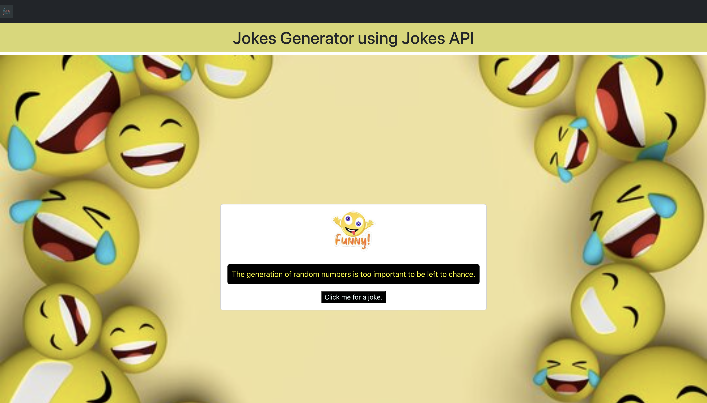

 a website that fetches data (joke) from an external API and displays it on the screen. We’ll be using React completely to base this website. Each time we reload the page and click the button, a new joke fetched and rendered on the screen by React. As we are using React for this project, we need not reload the page to display the fetched data.
 

 <h1>
 Prerequisite
 </h1>

 <ul>
React
Function Components
ReactJS AJAX and API
useState
 </ul>

 <h1> File Structure </h1>
App.js: This file imports the components to render it on the web page
Joke.js: This file contains the joke to be displayed and makes the API call
Joke.css: This file contains the styling of all the elements 
Button.js: This file contains the button component which generates the joke on click
Button.css: This file contains the styling of button element

<h1> To run Application </h1>
Step 1: Type the following command in terminal of your project directory
npm start
Step 2: Type the following URL in your web browser.
http://localhost:3000/